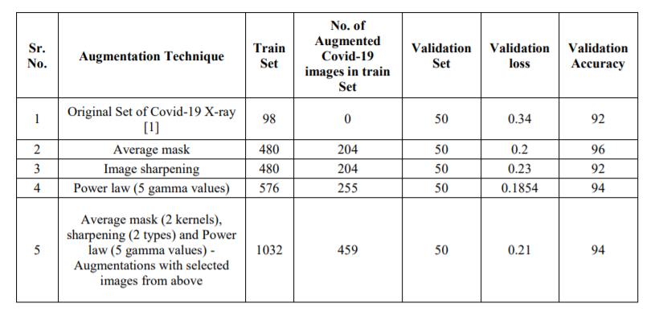

**Covid-19 X-ray Image Augmentation using Spatial Transformations**

Shubham Chaudhari, Trupti Chavan, Vmvijayayuvaram Singh, Guda
Ramachandra Kaladhara Sarma, Kameshwar Rao JV,

The lack of data is a major problem in medical image understanding using
convolutional neural network (CNN). In this work, we have used the
spatial transforms like negative, histogram equalization, power law,
sharpening, averaging, gaussian blurring, etc. to address the medical
image augmentation issue for detection of Covid-19 from X-ray images.
These augmentations help to generate more samples, serve as
pre-processing methods and highlight the features of interest. The
experimentation is done on the [Covid-19
dataset](https://github.com/ieee8023/covid-chestxray-dataset) \[1\]
which is a collection of Chest X-ray images of COVID-19 cases. To detect
COVID-19 class, Densenet-121 model is used. We have shortlisted average,
image sharpening and power law as the more suitable augmentations. The
average transformation is a traditional augmentation method and is the
mean of the pixels over *n*×*n* image mask. To generate images with more
low frequencies, different mask sizes of (3 and 5) are considered. The
image sharpening is the addition of high frequency and original image
and helps to enhance the high frequencies like edges which may not be
visible in poor quality images. To generate the high frequency images,
various techniques (such as Laplacian mask, canny edge detector, Sobel
filter and subtraction of smoothed image from original) are used. The
power law transformation manipulates the contrast of an image, performs
calibration and is useful to ease the detection of fractures. It is
computed by taking the gamma power of image intensities. In this work,
various gamma values are used in the range 0.4-0.6 and number of images
are generated. The sample images generated after augmentation are shown
in Figure 1.

Figure 1: (a) Original image, (b) Average, (c) Power law and (d) Image
sharpening

The results obtained using these augmentation techniques on COVID-19
X-ray image dataset are given in Table 1:

  
References:

1\. Covid-19 Chest X-ray Dataset:
<https://github.com/ieee8023/covid-chestxray-dataset>

